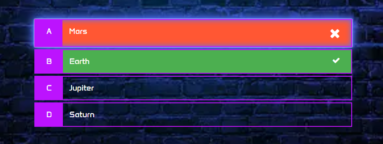
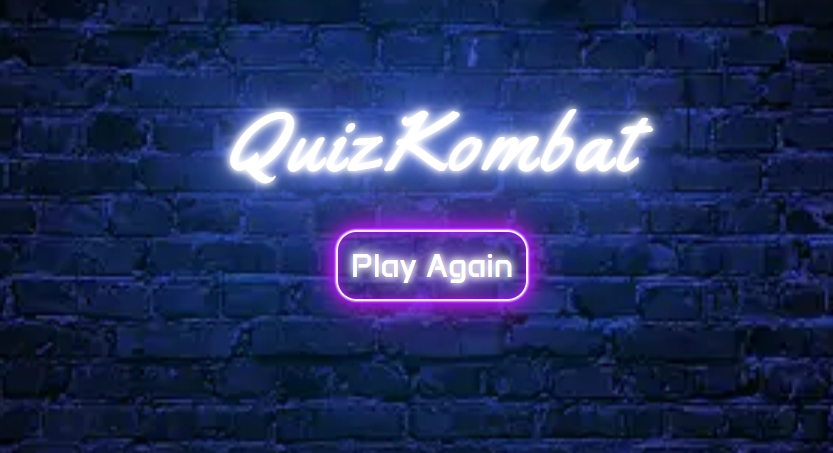

# QuizKombat

QuizKombat is designed to test your general knowledge through 10 different questions. Quizzes are a great way to learn, enhance your memory and add a sprinkle of fun and entertainment to your brain workout!

[View Quizkombat on GitHub Pages](https://rdhadda.github.io/QuizKombat/index.html)

## CONTENTS

- [User Experience (UX)](#User-Experience-UX)

  - [User Stories](#User-Stories)

- [Design](#Design)

  - [Colour Scheme](#Colour-Scheme)
  - [Typography](#Typography)
  - [Imagery](#Imagery)
  - [Wireframes](#Wireframes)
  - [Features](#Features)
    - [The Home Page](#home-page)
    - [The Game Page](#games-page)
    - [The Scores Page](#scores-page)
    - [The 404 Error Page](#404-error-page)
  - [Accessibility](#Accessibility)

- [Technologies Used](#Technologies-Used)

  - [Languages Used](#Languages-Used)
  - [Frameworks, Libraries & Programs Used](#Frameworks,-Libraries-and-Programs-Used)

- [Deployment and Local Development](#Deployment-and-Local-Development)

  - [Deployment](#Deployment)
  - [Local Development](#Local-Development)
    - [How to Fork](#How-to-Fork)
    - [How to Clone](#How-to-Clone)

- [Testing](#Testing)

  - [Solved Bugs](#Solved-Bugs)
  - [Known Bugs](#Known-Bugs)

- [Credits](#Credits)
  - [Code Used](#Code-Used)
  - [Media](#Media)
  - [Acknowledgments](#Acknowledgments)

---

## User Experience (UX)

QuizKombat is an interactive website that is designed to test the general knowledge of a player and provide personalized feedback based on their answer. The target audience for QuizKombat would be from age 12 upwards. The difficulty of the questions varies across easy, medium and hard categories.

Generally, easy questions seem suitable for a wide age range, including children and young teenagers, as they cover basic knowledge in various subjects such as geography, science, and history. Medium questions may be suitable for older teenagers and adults, as they require a bit more critical thinking and knowledge depth. Hard questions are suited more for adults or older teenagers with advanced knowledge in the respective subjects.

### User Stories

#### First Time Visitor Goals

- I want to be able to play quiz online.
- I want to be able to navigate through the website with ease.
- I want to be able to enter my name.
- I want the website to be responsive across varying devices.

#### Returning Visitor Goals

- I want a variety of questions across different subjects.
- I want to be able to select the difficulty of the questions being asked.

#### Frequent Visitor Goals

- I want a variety of questions across different subjects.
- I want to be able to select the difficulty of the questions being asked.

## Design

### Colour Scheme

My choice was an arcade theme complete with neon light effects. I think this adds a retro feel to the website. The [coolors](https://coolors.co/) website was used to develop the colour palette.

For the correct and incorrect classes I chose the following colour pallete.

### Typography

Google Fonts was used for the following fonts:

- Yellowtail is used for the main QuizKombat logo.
- Anta is used for the progress bar, questions, different answer choices and buttons.

### Imagery

All images on the webpage were taken from Pixabay. I have credited these in the [credits](#credits) section.

### Wireframes

Wireframes were created for mobile, tablet and desktop using Balsamiq.

[Desktop Wireframes](documentation/desktop-wireframe.png)

[Tablet Wireframes](documentation/tablet-wireframe.png)

[Mobile Wireframes](documentation/mobile-wireframe.png)

### Features

The website consists of four pages. A home page, games page, score page and 404 page.

#### All four pages have the following elements in common:

- The title of the webpage QuizKombat. The title also acts as a link back to the homepage.
- All of the web pages have the same brick wall background image to have a consistent theme throughout.

#### Home Page

- The website title QuizKombat appears on the homepage.
- An input box for the player to enter their name. This is used later on for the score page.
- An accordion with playing instructions which explains how to play the game.
- A button that says "start game," enabling the player to begin playing once their name has been entered.

#### Games Page

- The website title QuizKombat.
- Three buttons, for the player to select the difficulty of the questions asked. The questions will be only displayed once the difficulty level has been selected. Once the difficulty has been selected, the difficulty buttons become un-clickable and the answer choices which are initially disabled will become available to click.
- A progress bar to indicate to the player which question they're on.
- A question and four answer choices. Upon selecting the correct answer the answer will be highlighted green and their score will be incremented, if the incorrect answer is selected the choice will be highlighted red and the correct answer will be highlighted green.

#### Scores Page

- Once the player has answered 10 questions they will be taken through to the scores page which will display their final score, name and a message based upon their score.
- A button to replay the game.

#### 404 Error Page

- The website title, QuizKombat
- An error message.
- A button re-directing the player back to the homepage.

#### Future Implementations

- Use an API to display the questions and answer selections.
- Allow the player to select the amount of questions to be asked.

### Accessibility

I've taken care when coding to make the website as player-friendly and as accessible as I can. I've accomplished this by:

- Using semantic HTML.
- Using descriptive alt attributes for images throughout the site.
- Selecting a sans-serif font which is suitable for users with dyslexia.
- Ensuring that the site has an adequate amount of colour contrast.
- Displaying symbols for correct/incorrect answers.
  

## Technologies Used

### Languages Used

- HTML, CSS and Javascript

### Frameworks, Libraries and Programs Used

[Balsamiq](https://balsamiq.com/) - Used to create wireframes.

[Visual Studio Code](https://code.visualstudio.com/) IDE was used to create the website.

[Git](https://git-scm.com/) - For version control.

[Github](https://github.com/) - To save and store the files for the website.

[Google Fonts](https://fonts.google.com/) - To import the fonts used on the website.

Google Dev Tools - To troubleshoot and test features, and solve issues with responsiveness and styling.

[Am I Responsive](https://ui.dev/amiresponsive) To show the website across a range of devices.

[Fontawsome](https://fontawesome.com/start) For the cross and tick.

[Pixabay](https://pixabay.com/illustrations/wall-masonry-facade-black-wall-2059909/) For the background image.

[Squoosh](https://squoosh.app/) Compress images and convert to webp format.

[Sheilds](https://shields.io/) Add badges to README.

[Icons8](https://icons8.com/) Add favicon.

## Deployment and Local Development

### Deployment

Github Pages was used to deploy the live website. The instructions to achieve this are below:

1. Log in (or sign up) to Github.
2. Find the repository for this project, QuizKombat
3. Click on the Settings link.
4. Click on the Pages link in the left-hand side navigation bar.
5. In the Source section, choose main from the drop-down select branch menu. Select Root from the drop-down select folder menu.
6. Click Save. Your live Github Pages site is now deployed at the URL shown.

### Local Development

#### How to Fork

To fork the repository:

1. Log in (or sign up) to Github.
2. Go to the repository for this project, rdhadda/QuizKombat
3. Click the Fork button in the top right corner.

#### How to Clone

To clone the QuizKombat repository:

1. Log in (or sign up) to GitHub.
2. Go to the repository for this project, rdhadda/QuizKombat
3. Click on the code button, select whether you would like to clone with HTTPS, SSH or GitHub CLI and copy the link shown.
4. Open the terminal in your code editor and change the current working directory to the location you want to use for the cloned directory.
5. Type 'git clone' into the terminal and then paste the link you copied in step 3. Press enter.

## Testing

Please see [TESTING.md](TESTING.md) file for both automated and manual testing.

### Solved Bugs

1. After the player has completed the quiz, I wanted the user's final score to be displayed on the score.html page. I tried to replace the inner text of the p tag with the id of final-score-number. However, the score wasn't being displayed. After a little research, I came across the localStorage property on w3 schools. This then allowed me to save the user's score in local storage to use on the score.html page. After doing this I realised that the score remained in local storage. To remove this from local storage and reset each time the game is restarted I used the localStorage.remove() property in the startGame function.

2. After the game has ended I wanted the player to be redirected to the score.html page to view their final score. However, I wasn't too sure how to accomplish this. Again with a little bit of research I found a solution on stackoverflow which is location.assign("/score.html"). This allowed me to direct the player to the score.html page to view their final score.

3. I wanted to highlight the correct answer to the player if they had chosen the incorrect one. At first I tried to add the correct class to the currentQuestion.answer if the user selected the incorrect answer. This failed to work. After thinking this through I realised, I needed to use a loop to iterate through the currentQuestions and select the correct answer in the array to apply the correct class.

4. When testing for responsiveness I discovered the brick wall background image wasn't appearing on the whole screen and there were white spaces. I initially had the background image set to no-repeat, after I removed no-repeat the image displayed across the whole screen.

5. Upon deploying QuizKombat to github pages, the redirection to score.html wasn't working properly. I altered the redirection address to "https://rdhadda.github.io/QuizKombat/score.html" rather than "/score.html" and the redirection issue was resolved.

6. When implementing the different difficulty levels of the quiz, I initially had the difficulty buttons on index.html. I then used a spread operator to declare an array for the buttons and used an event listener on game.js to see which difficulty level was clicked to determine which set of questions to ask. However, when console logging the variable to the console the array was empty. Rather than placing the difficulty buttons on index.html I placed them on game.html, I went through the same process and my variable and event listener was now working.

### Known Bugs

1. Occasionally, once the player has finished the game, their score isn't displayed on the score.html page. I'm not quite sure as to why this happening. I'm hoping to resolve this once my knowledge increases throughout the course.

2. When playing QuizKombat on a touch device the hover state remains on the button. This isn't removed until the next button is selected.

3. On the homepage, when the player enters their name via autofill the styling is overridden by the browser's default styling.

   

## Credits

### Code Used

- I used [w3Schools](https://www.w3schools.com/howto/howto_js_accordion.asp) on how to create an accordion.

- I also used [w3Schools](https://www.w3schools.com/jsref/prop_win_localstorage.asp) on how to store the player's score in local storage to see it on a different html page.

- [Stackoverflow](https://stackoverflow.com/questions/442384/jumping-to-a-new-html-page-with-javascript) helped me to solve how to direct to another html page.

- [CSS-TRICKS](https://css-tricks.com/how-to-create-neon-text-with-css/) helped me to produce the neon effect text and buttons.

### Media

- The background image was taken from [Pixabay](https://pixabay.com/illustrations/wall-masonry-facade-black-wall-2059909/)

### Acknowledgments

- My mentor for their guidance and support.
- My cohort for support.
- Code Institute for informative course material.
- The Slack community for help and support.
