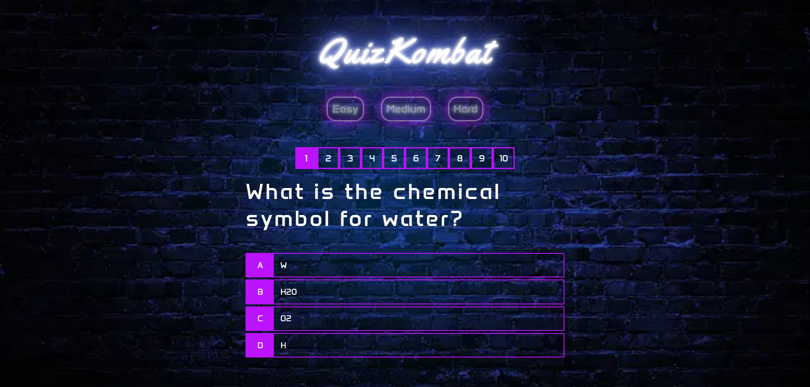
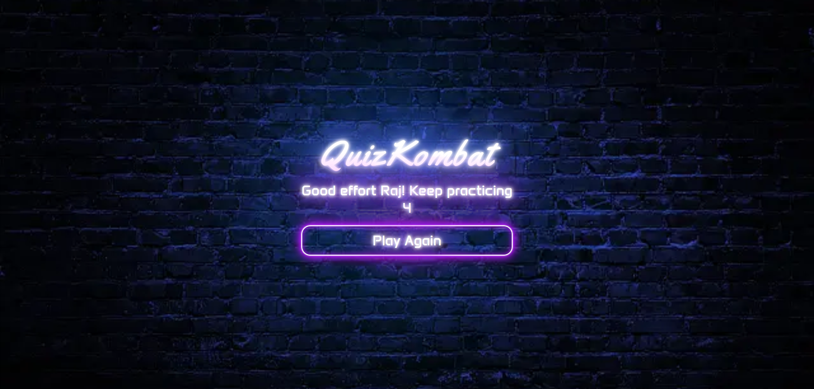

# QuizKombat

QuizKombat is designed to test your general knowledge through 10 different questions. Quizzes are a great way to learn, enhance your memory and add a sprinkle of fun and entertainment to your brain workout!

[View Quizkombat on GitHub Pages](https://rdhadda.github.io/QuizKombat/index.html)

## CONTENTS

- [User Experience (UX)](#User-Experience-UX)

  - [User Stories](#User-Stories)

- [Design](#Design)

  - [Colour Scheme](#Colour-Scheme)
  - [Typography](#Typography)
  - [Imagery](#Imagery)
  - [Wireframes](#Wireframes)
  - [Features](#Features)
  - [Accessibility](#Accessibility)

- [Technologies Used](#Technologies-Used)

  - [Languages Used](#Languages-Used)
  - [Frameworks, Libraries & Programs Used](#Frameworks,-Libraries-and-Programs-Used)

- [Deployment and Local Development](#Deployment-and-Local-Development)

  - [Deployment](#Deployment)
  - [Local Development](#Local-Development)
    - [How to Fork](#How-to-Fork)
    - [How to Clone](#How-to-Clone)

- [Testing](#Testing)
  - [W3C Validator](#W3C-Validator)
  - [Solved Bugs](#Solved-Bugs)
  - [Known Bugs](#Known-Bugs)
  - [Testing User Stories](#Testing-User-Stories)
  - [Lighthouse Testing](#Lighthouse-Testing)
  - [Wave Testing](#Wave-Testing)
  - [Full Testing](#Full-Testing)
- [Credits](#Credits)
  - [Code Used](#Code-Used)
  - [Media](#Media)
  - [Acknowledgments](#Acknowledgments)

---

## User Experience (UX)

### User Stories

#### First Time Visitor Goals

- I want to be able to play quiz online.
- I want to be able to navigate through the website with ease.
- I want the website to be responsive across varying devices.

#### Returning Visitor Goals

- I want a variety of questions across different subjects.

#### Frequent Visitor Goals

- I want a variety of questions across different subjects.

## Design

### Colour Scheme

I opted for an arcade style theme with neon light effects. The colour pallete was created using the [coolors](https://coolors.co/) website.

### Typography

Google Fonts was used for the following fonts:

- Yellowtail is used for the main QuizKombat logo.
- Anta is used for the progress bar, questions, different answer choices and buttons.

### Imagery

All images on the webpage were taken from Pixabay. I have credited these in the [credits](#credits) section.

### Wireframes

Wireframes were created for mobile, tablet and desktop using Balsamiq.

[Desktop Wireframes](docs/desktop-wireframe.png)

[Tablet Wireframes](docs/tablet-wireframe.png)

[Mobile Wireframes](docs/mobile-wireframe.png)

### Features

The website consists of four pages. A home page, games page, score page and 404 page.

#### All four pages have the following elements in common:

- The title of the webpage QuizKombat. The title also acts as a link back to the homepage.

#### Home Page

- The website title QuizKombat appears on the homepage.
- An accordian with playing instructions that explains how to play the game.
- A button that says "start game," enabling the player to begin playing.

#### Games Page

- The website title QuizKombat.
- A progress bar to indicate to the player which question they're on.
- A question and four answer choices. Upon selecting the correct answer the answer will be highlighted green and their score will be incremented, if the incorrect answer is selected the choice will be highlighted red and the correct answer will be highlighted green.

#### Scores Page

- Once the player has answered 10 questions they will be taken through to the scores page will display their final score.
- A button to replay the game.

#### 404 Error Page

- The website title QuizKombat
- An error message.
- A button directing the player back to the homepage.

#### Future Implementations

- Allowing the player to select the difficulty level of the questions asked.
- Allow the player to select the amount of questions to be asked.

### Accessibility

I've taken care when coding to make the website as player-friendly and as accessible as I can. I've accomplished this by:

- Using semantic HTML.
- Using descriptive alt attributes for images throughout the site.
- Selecting a sans-serif font which is suitable for users with dyslexia.
- Ensuring that the site has an adequate amount of colour contrast.
- Displaying symbols for correct/incorrect answers.

## Technologies Used

### Languages Used

- HTML, CSS and Javascript

### Frameworks, Libraries and Programs Used

[Balsamiq](https://balsamiq.com/) - Used to create wireframes.

[Visual Studio Code](https://code.visualstudio.com/) IDE was used to create the website.

[Git](https://git-scm.com/) - For version control.

[Github](https://github.com/) - To save and store the files for the website.

[Google Fonts](https://fonts.google.com/) - To import the fonts used on the website.

Google Dev Tools - To troubleshoot and test features, and solve issues with responsiveness and styling.

[Am I Responsive](https://ui.dev/amiresponsive) To show the website across a range of devices.

[Fontawsome](https://fontawesome.com/start) For the cross and tick.

[Pixabay](https://pixabay.com/illustrations/wall-masonry-facade-black-wall-2059909/) For the background image.

[Squoosh](https://squoosh.app/) Compress images and convert to webp format.

[Sheilds](https://shields.io/) Add badges to README.

[Icons8](https://icons8.com/) Add favicon.

## Deployment and Local Development

### Deployment

Github Pages was used to deploy the live website. The instructions to achieve this are below:

1. Log in (or sign up) to Github.
2. Find the repository for this project, QuizKombat
3. Click on the Settings link.
4. Click on the Pages link in the left-hand side navigation bar.
5. In the Source section, choose main from the drop-down select branch menu. Select Root from the drop-down select folder menu.
6. Click Save. Your live Github Pages site is now deployed at the URL shown.

### Local Development

#### How to Fork

To fork the repository:

1. Log in (or sign up) to Github.
2. Go to the repository for this project, rdhadda/QuizKombat
3. Click the Fork button in the top right corner.

#### How to Clone

To clone the QuizKombat repository:

1. Log in (or sign up) to GitHub.
2. Go to the repository for this project, rdhadda/QuizKombat
3. Click on the code button, select whether you would like to clone with HTTPS, SSH or GitHub CLI and copy the link shown.
4. Open the terminal in your code editor and change the current working directory to the location you want to use for the cloned directory.
5. Type 'git clone' into the terminal and then paste the link you copied in step 3. Press enter.

## Testing

Testing was continuous throughout the website build. I used Chrome developer tools to identify and address any issues as they arose.

## Automated Testing

### W3C Validator

W3C validator was used to validate the HTML on all pages of the website. It was also used to validate CSS in the style.css file.

- [Index Page HTML](docs/w3-index.png)
- [Game Page HTML](docs/w3-game.png)
- [Score Page HTML](docs/w3-end.png)
- [404 Page HTML](docs/w3-404.png)
- [style.css CSS](docs/w3-css.png)

### JavaScript Validator

[jshint](https://jshint.com/) was used to validate the JavaScript.

- [script.js](documentation/jshint-script.js.png)
- [game.js](documentation/jshint-game.js.png)
- [end.js](documentation/jshint-end.js.png)

### Solved Bugs

1. After the player has completed the quiz, I wanted the user's final score to be displayed on the end.html page. I tried to replace the inner text of the p tag with the id of final-score-number. However, the score wasn't being displayed. After a little research, I came across the localStorage property on w3 schools. This then allowed me to save the user's score in local storage to use on the end.html page. After doing this I realised that the score remained in local storage. In order to remove this from local storage and reset each time the game is restarted I used the localStorage.remove() property in the startGame function.

2. After the game has ended I wanted the player to be redirected to the end.html page to view their final score. However, I wasn't too sure how to accomplish this. Again with a little bit of research I found a solution on stackoverflow which is location.assign("/end.html"). This allowed me to direct the player to the end.html page to view their final score.

3. I wanted to highlight the correct answer to the player if they had chosen the incorrect one. At first I tried to add the correct class to the currentQuestion.answer, but this failed to work. After thinking this through I realised, I needed to use a loop to iterate through the currentQuestions array in order to apply the correct class to the correct answer.

### Known Bugs

1. Occasionally, once the player has finished the game, their score isn't displayed on the end.html page.

### Testing User Stories

#### First Time Visitors

| Goals                                                        | How are they achieved?                                                                                                         |
| :----------------------------------------------------------- | :----------------------------------------------------------------------------------------------------------------------------- |
| I want to be able to play quiz online.                       | QuizKombat is a web-based quiz, which accessible across desktop, tablet and mobile devices.                                    |
| I want to be able to navigate through the website with ease. | The website uses a series of buttons to allow the player to easily navigate the website.  |
| I want the website to be responsive across varying devices.  | Media queries have been used in order to make QuizKombat responsive.                                                           |

#### Returning Visitors and Frequent Visitors

| Goals                                                    | How are they achieved?                                                                     |
| :------------------------------------------------------- | :----------------------------------------------------------------------------------------- |
| I want a variety of questions across different subjects. | There are a variety of questions which are randomly selected each time the game is played. |

### Lighthouse Testing

I took the opportunity to utilize Lighthouse within Chrome Developer Tools. This allowed me to test for performance, accessibility, best practices and the SEO (search engine optimization) of the website.

#### Index.html Desktop Page

#### Game.html Desktop Page

#### End.html Desktop Page

#### 404.html Desktop Page

### Mobile Testing

#### Index.html Page

#### Game.html Page

#### End.html Page

#### 404.html Page

### Wave Testing

- [Index Page HTML](docs/wave-index.png)
- [Packages Page HTML](docs/wave-packages.png)
- [Gallery Page HTML](docs/wave-gallery.png)
- [404 Page HTML](docs/wave-404.png)

### Full Testing

Full testing was performed on the following devices:

- Laptop:

  - Macbook Pro 2015 13 inch screen

- Mobile Devices:
  - iPhone 12 pro.
  - iPhone 11 pro.
  - Phone X.

Each device tested the site using the following browsers:

- Google Chrome
- Safari

#### Home Page

| Feature                    | Expected Outcome                                                       | Testing Performed                  | Result                                                      | Pass/Fail |
| -------------------------- | ---------------------------------------------------------------------- | ---------------------------------- | ----------------------------------------------------------- | --------- |
| The Sites title            | Link directs the user back to the home page                            | Clicked title                      | Home page reloads                                           | Pass      |
| Start Game                 | Directs the user to the game page                                      | Clicked on button                  | Game page opens to display the questions                    | Pass      |
| How to play button         | Opens the accordion with the instructions on how to play the game      | Clicked on button                  | accordion with instructions on how to play opens            | Pass      |
| All buttons - hover effect | All purple buttons should highlight with a blue neon effect background | Hover over each button on the page | Each button displayed the correct styling when hovered over | Pass      |

#### Game Page

| Feature                    | Expected Outcome                                                                                                                                | Testing Performed                  | Result                                                                                                   | Pass/Fail |
| -------------------------- | ----------------------------------------------------------------------------------------------------------------------------------------------- | ---------------------------------- | -------------------------------------------------------------------------------------------------------- | --------- |
| The Sites title            | Link directs the user back to the home page                                                                                                     | Clicked title                      | Home page reloads                                                                                        | Pass      |
| All buttons - hover effect | All purple buttons should highlight with a blue neon effect background                                                                          | Hover over each button on the page | Each button displayed the correct styling when hovered over                                              | Pass      |
| Question populated         | The question from available questions array is correctly pulled from game.js                                                                    | started a new game                 | The question is displaying                                                                               | Pass      |
| Answers populated          | The answers from available questions array is correctly pulled from game.js                                                                     | started a new game                 | The question is displaying                                                                               | Pass      |
| Correct answer             | When a correct answer is clicked the box around the answer should display green with a tick                                                     | Clicked on a correct answer        | box displayed green with a tick                                                                          | Pass      |
| Incorrect answer           | When an incorrect answer is clicked the answer should highlight red with a cross and the correct answer should be highlighted green with a tick | Clicked incorrect answer           | incorrect answer is highlighted red with a cross and the correct answer is highlighted green with a tick | Pass      |
| Progress bar               | When a question has been answered the progress bar should increment by one                                                                      | Clicked answer box                 | Progress bar is incremented by 1                                                                         | Pass      |

#### Score Page

| Feature                    | Expected Outcome                                                       | Testing Performed                  | Result                                                      | Pass/Fail |
| -------------------------- | ---------------------------------------------------------------------- | ---------------------------------- | ----------------------------------------------------------- | --------- |
| The Sites title            | Link directs the user back to the home page                            | Clicked title                      | Home page reloads                                           | Pass      |
| All buttons - hover effect | All purple buttons should highlight with a blue neon effect background | Hover over each button on the page | Each button displayed the correct styling when hovered over | Pass      |
| Play Again - Button        | Directs the user to the game page                                      | Clicked on button                  | Game page opens to display the questions                    | Pass      |

#### 404 Page

| Feature                    | Expected Outcome                                                       | Testing Performed                  | Result                                                      | Pass/Fail |
| -------------------------- | ---------------------------------------------------------------------- | ---------------------------------- | ----------------------------------------------------------- | --------- |
| The Sites title            | Link directs the user back to the home page                            | Clicked title                      | Home page reloads                                           | Pass      |
| All buttons - hover effect | All purple buttons should highlight with a blue neon effect background | Hover over each button on the page | Each button displayed the correct styling when hovered over | Pass      |
| Take Me Home - Button      | Directs the user to the homepage page                                  | Clicked on button                  | Homepage is displayed                                       | Pass      |

## Credits

### Code Used

- I used [w3Schools](https://www.w3schools.com/howto/howto_js_accordion.asp) on how to create an accordion.

- I also used [w3Schools](https://www.w3schools.com/jsref/prop_win_localstorage.asp) on how to store the player's score in local storage in order to see it on a different html page.

- [Stackoverflow](https://stackoverflow.com/questions/442384/jumping-to-a-new-html-page-with-javascript) helped me to figure out how to direct to another html page.

- [CSS-TRICKS](https://css-tricks.com/how-to-create-neon-text-with-css/) helped me to produce the neon effect text and buttons.

### Media

- The background image was taken from [Pixabay](https://pixabay.com/illustrations/wall-masonry-facade-black-wall-2059909/)

### Acknowledgments

- My mentor for their guidance and support.
- My cohort for support.
- Code Institute for informative course material.
- The Slack community for help and support.
