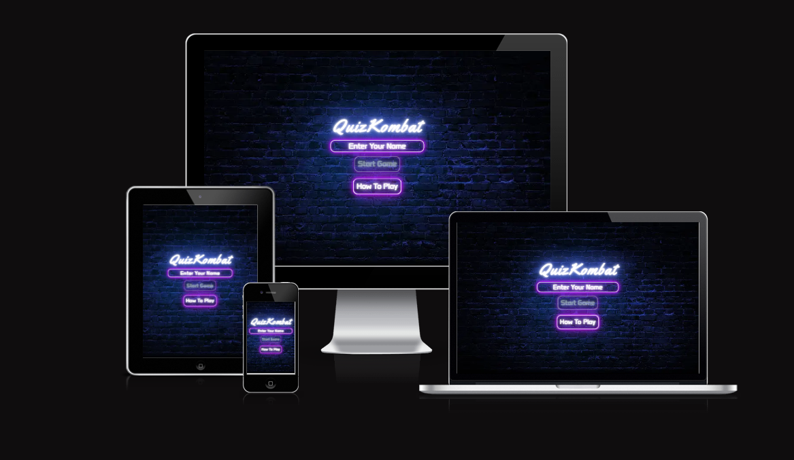
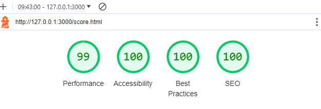
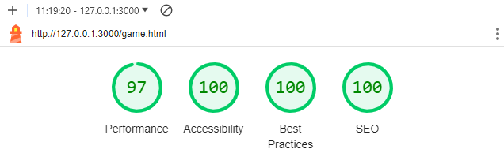
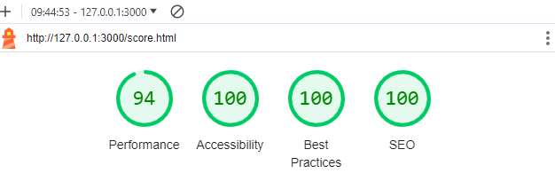
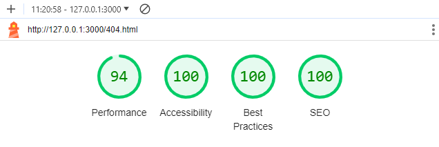
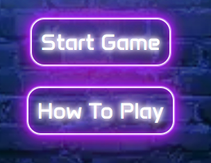

# QuizKombat - Testing

[View Quizkombat on GitHub Pages](https://rdhadda.github.io/QuizKombat/index.html)

## CONTENTS

- [Automated Testing](#Automated-Testing)
  - [W3C Validator](#W3C-Validator)
  - [JavaScript Validator](#JavaScript-Validator)
  - [Lighthouse Testing](#Lighthouse-Testing)
  - [Wave Testing](#Wave-Testing)
- [Manual Testing](#Manual-Testing)
  - [Testing User Stories](#Testing-User-Stories)
  - [Full Testing](#Full-Testing)

## Testing

Testing was continuous throughout the website build. I used Chrome developer tools to identify and address any issues as they arose. I also used console.log() throughout the JavaScript build to determine whether I was receiving the correct output from my functions and variables.

- My automated testing consisted of using W3C Validator, JSHint, Lighthouse and Wave.
- I then manually tested the user stories along with the functionality of the website.

## Automated Testing

### W3C Validator

W3C validator was used to validate the HTML on all pages of the website. It was also used to validate CSS in the style.css file.

- [Index Page HTML](docs/w3-index.png)
- [Game Page HTML](docs/w3-game.png)
- [Score Page HTML](docs/w3-score.png)
- [404 Page HTML](docs/w3-404.png)
- [style.css CSS](docs/w3-css.png)

### JavaScript Validator

[JSHint](https://jshint.com/) was used to validate the JavaScript.

- [Script.js](documentation/jshint-script.js.png)
- [Game.js](documentation/jshint-game.js.png)
- [Score.js](documentation/jshint-score.js.png)
- [Questions.js](documentation/jshint-questions.js.png)

### Lighthouse Testing

I took the opportunity to utilize Lighthouse within Chrome Developer Tools. This allowed me to test for performance, accessibility, best practices and the SEO (search engine optimization) of the website.

#### Index.html Desktop Page

#### Game.html Desktop Page

#### Score.html Desktop Page

#### 404.html Desktop Page

### Mobile Testing

#### Index.html Page

#### Game.html Page

#### Score.html Page

#### 404.html Page

### Wave Testing

When first running the wave tests on QuizKombat there were various contrast errors appearing. The reason for this was the background colour of the body was defaulted to white. After changing the background colour of the body to black and re-running the wave tests all contrast errors were gone.

- [Index Page HTML](documentation/wave-index.html.png)
- [Game Page HTML](documentation/wave.game.html.png)
- [Score Page HTML](documentation/wave-score.html.png)
- [404 Page HTML](documentation/wave-404.html.png)

### Manual Testing

### Testing User Stories

#### First Time Visitors

| Goals                                                        | How are they achieved?                                                                                                         |
| :----------------------------------------------------------- | :----------------------------------------------------------------------------------------------------------------------------- |
| I want to be able to play quiz online.                       | QuizKombat is a web-based quiz, which accessible across desktop, tablet and mobile devices.                                    |
| I want to be able to navigate through the website with ease. | The website uses a series of buttons to allow the player to easily navigate the website.  |
| I want to be able to enter my name.                          | There is an input field on the home page which allows the user to enter their name.                                            |
| I want the website to be responsive across varying devices.  | Media queries have been used in order to make QuizKombat responsive.                                                           |

#### Returning Visitors and Frequent Visitors

| Goals                                                                    | How are they achieved?                                                                                                                                                              |
| :----------------------------------------------------------------------- | :---------------------------------------------------------------------------------------------------------------------------------------------------------------------------------- |
| I want a variety of questions across different subjects.                 | There are a variety of questions which are randomly selected each time the game is played.                                                                                          |
| I want to be able to select the difficulty of the questions being asked. | On the game page of QuizKombat, the player is presented with three difficulty level buttons. Once selected the questions being asked will be determined on the difficulty selected. |

### Full Testing

Full testing was performed on the following devices:

- Laptop:

  - Macbook Pro 2015 13 inch screen

- Mobile Devices:
  - iPhone 15 pro.
  - iPhone 12 pro.
  - iPhone 11 pro.
  - Phone X.

Each device tested the site using the following browsers:

- Google Chrome
- Safari

#### Home Page

| Feature                                            | Expected Outcome                                                       | Testing Performed                  | Result                                                      | Pass/Fail |
| -------------------------------------------------- | ---------------------------------------------------------------------- | ---------------------------------- | ----------------------------------------------------------- | --------- |
| The Sites title                                    | Link directs the user back to the home page                            | Clicked title                      | Home page reloads                                           | Pass      |
| Enter Your Name Input                              | Allows Player to Enter their name                                      | Entered name                       | Name is displayed                                           | Pass      |
| Start Game button becomes is initially unavailable | Button becomes available to click once a player has entered their name | Entered name                       | Button becomes available to click                           | Pass      |
| Start Game                                         | Directs the user to the game page                                      | Clicked on button                  | Game page opens to display the questions                    | Pass      |
| How to play button                                 | Opens the accordion with the instructions on how to play the game      | Clicked on button                  | accordion with instructions on how to play opens            | Pass      |
| All buttons - hover effect                         | All purple buttons should highlight with a blue neon effect background | Hover over each button on the page | Each button displayed the correct styling when hovered over | Pass      |

#### Game Page

| Feature                                                            | Expected Outcome                                                                                                                                | Testing Performed                                              | Result                                                                                                   | Pass/Fail |
| ------------------------------------------------------------------ | ----------------------------------------------------------------------------------------------------------------------------------------------- | -------------------------------------------------------------- | -------------------------------------------------------------------------------------------------------- | --------- |
| The Sites title                                                    | Link directs the user back to the home page                                                                                                     | Clicked title                                                  | Home page reloads                                                                                        | Pass      |
| Easy Button                                                        | Easy questions are displayed                                                                                                                    | Click easy button                                              | Easy questions are displayed                                                                             | Pass      |
| Medium Button                                                      | Medium questions are displayed                                                                                                                  | Click easy button                                              | Medium questions are displayed                                                                           | Pass      |
| Hard Button                                                        | Hard questions are displayed                                                                                                                    | Click easy button                                              | Hard questions are displayed                                                                             | Pass      |
| Easy/Medium/Hard Button Disabled                                   | Once one of the buttons are clicked all three buttons become un-clickable                                                                       | Click easy/medium/hard button                                  | All buttons become un-clickable                                                                          | Pass      |
| Choice boxes disabled until player selects difficulty of questions | Choice boxes are disabled                                                                                                                       | Click easy/medium/hard button                                  | Choice boxes are no longer disabled and are clickable                                                    | Pass      |
| All buttons - hover effect                                         | All purple buttons should highlight with a blue neon effect background                                                                          | Hover over each button on the page                             | Each button displayed the correct styling when hovered over                                              | Pass      |
| Question populated                                                 | The question from available questions array is correctly pulled from question.js                                                                | Started a new game                                             | The question is displaying                                                                               | Pass      |
| Answers populated                                                  | The answers from available questions array is correctly pulled from question.js                                                                 | Started a new game                                             | The four answer choices are displaying correctly                                                         | Pass      |
| Unable to change answer selection                                  | Once a player has selected an answer, they're unable to change their selection                                                                  | Tried to select a different answer from the original selection | Unable to select alternate answer                                                                        | Pass      |
| Correct answer                                                     | When a correct answer is clicked the box around the answer should display green with a tick                                                     | Clicked on a correct answer                                    | box displayed green with a tick                                                                          | Pass      |
| Incorrect answer                                                   | When an incorrect answer is clicked the answer should highlight red with a cross and the correct answer should be highlighted green with a tick | Clicked incorrect answer                                       | incorrect answer is highlighted red with a cross and the correct answer is highlighted green with a tick | Pass      |
| Progress bar                                                       | When a question has been answered the progress bar should increment by one                                                                      | Clicked answer box                                             | Progress bar is incremented by 1                                                                         | Pass      |

#### Score Page

| Feature                                       | Expected Outcome                                                                              | Testing Performed                  | Result                                                      | Pass/Fail |
| --------------------------------------------- | --------------------------------------------------------------------------------------------- | ---------------------------------- | ----------------------------------------------------------- | --------- |
| The Sites title                               | Link directs the user back to the home page                                                   | Clicked title                      | Home page reloads                                           | Pass      |
| Score appears with a comment and players name | Once the player has successfully completed a game a message appears with their name and score | Completed a game                   | Message appears with name and score                         | Pass      |
| All buttons - hover effect                    | All purple buttons should highlight with a blue neon effect background                        | Hover over each button on the page | Each button displayed the correct styling when hovered over | Pass      |
| Play Again - Button                           | Directs the user to the game page                                                             | Clicked on button                  | Game page opens to display the questions                    | Pass      |

#### 404 Page

| Feature                    | Expected Outcome                                                       | Testing Performed                  | Result                                                      | Pass/Fail |
| -------------------------- | ---------------------------------------------------------------------- | ---------------------------------- | ----------------------------------------------------------- | --------- |
| The Sites title            | Link directs the user back to the home page                            | Clicked title                      | Home page reloads                                           | Pass      |
| All buttons - hover effect | All purple buttons should highlight with a blue neon effect background | Hover over each button on the page | Each button displayed the correct styling when hovered over | Pass      |
| Take Me Home - Button      | Directs the user to the homepage page                                  | Clicked on button                  | Homepage is displayed                                       | Pass      |
